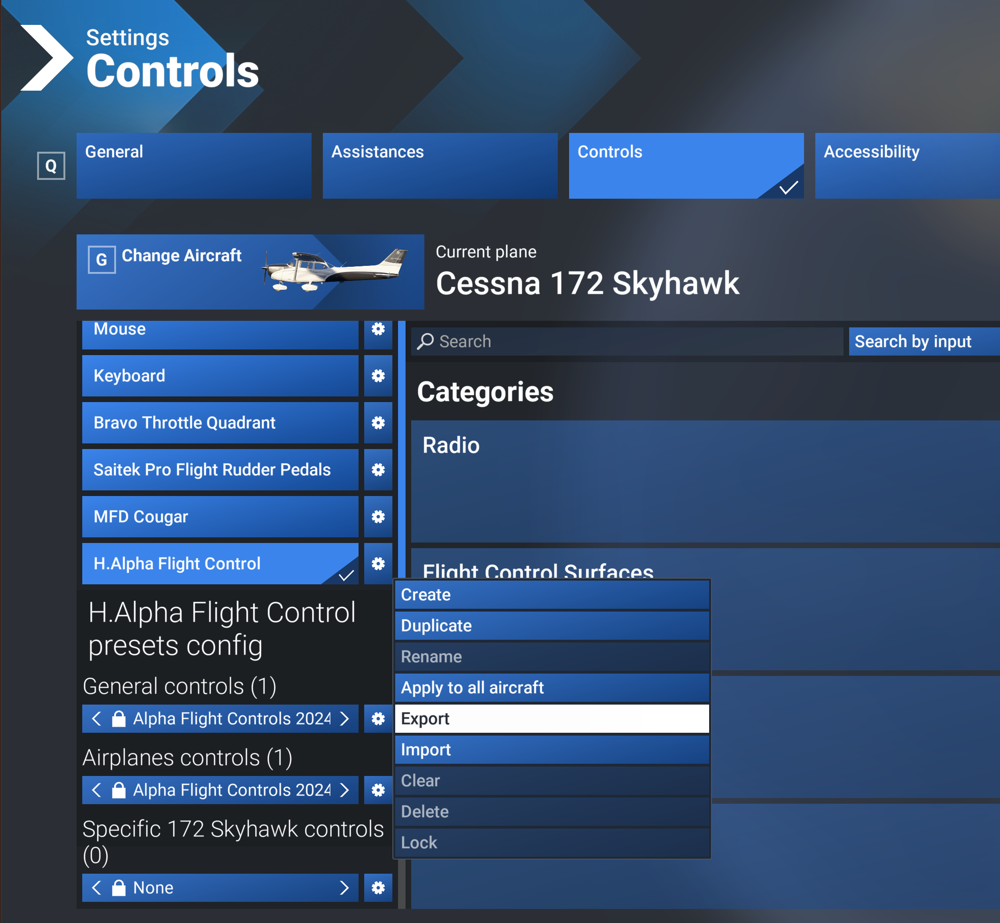
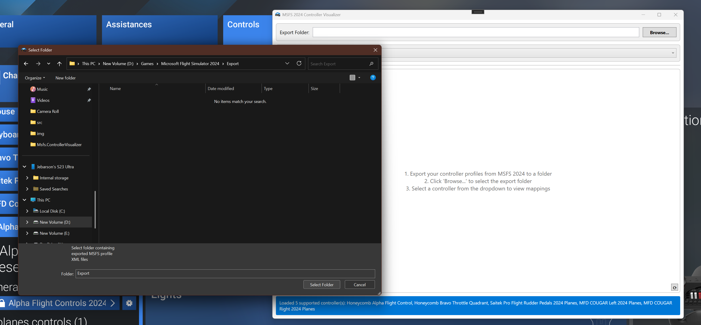
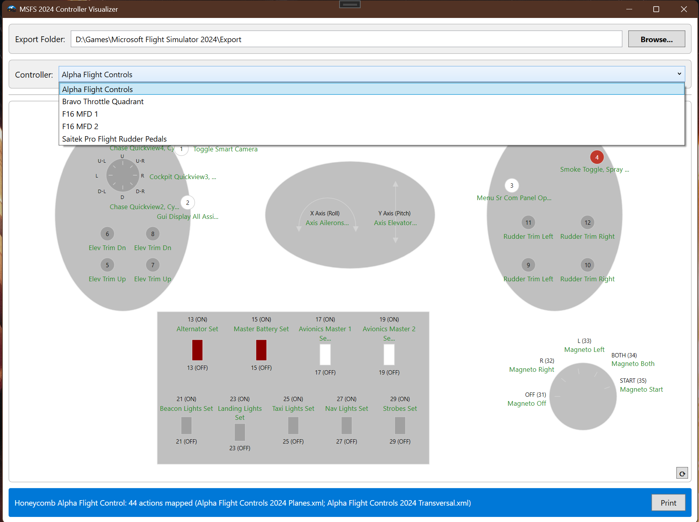

# MSFS 2024 Controller Visualizer

A Windows desktop tool that visualizes your Microsoft Flight Simulator 2024 controller bindings on controller-specific layouts.

This helps you quickly see which in-sim actions are mapped to each button, making it easier to review, print, and tune your profiles.

## What this tool does

- Loads exported MSFS 2024 controller profile XML files
- Detects supported controllers from the selected export folder
- Maps profile actions to normalized button IDs
- Renders a controller-specific visual with your current bindings
- Supports printing the rendered layout

## Supported controllers
- Honeycomb Alpha Flight Control
- Honeycomb Bravo Throttle Quadrant
- Saitek Pro Flight Rudder Pedals
- MFD Cougar Display (Left and Right)

## User Manual
This tool works with exported profile XML files from MSFS 2024. You must first export the controller profiles before you can visualize them in this tool. There is currently no way to read MSFS profiles directly without export, so this is a required step.

### 1) Export profile layout from MSFS

- Open control settings in MSFS 2024
- Select the device/profile you want to review
- Click the export button to save the profile to an XML file (hint: export all profiles for a device to the same folder).
- Repeat this for all devices you want to visualize in the app.

### 2) Select the export folder in the app

- Launch the tool (MSFSControllerVisualizer.exe) after extracting the zip file from the latest release. 
- Click the `Browse...` button and select the folder where you saved your exported XML profile files.
- The tool automatically discovers supported controllers from the XML files in that folder and populates the dropdown for selection.

### 3) View rendered button mappings

- After selecting a controller from the dropdown, the tool renders the visual layout for that controller with your current button mappings displayed.
- Click the `Print` button to print the rendered layout for reference while flying.

## Don't see your controller?
Unfortunately, I could only build layouts and mappings for the controllers I have access to. If you have a different controller and want to see it supported, you can contribute by:

- Exporting the controller profile from MSFS 2024
- Creating a new issue using the `New Controller Request` template and attaching the exported XML file
- If there are multiple profiles for the same controller, exporting and attaching all of them in the same issue

Hint: If you map as many buttons as possible before exporting, the resulting layout will be more accurate.

## Contributing
This project is open source, and contributions are welcome. If you want to contribute code:

- Read and understand the documents under `docs/`.
- File a new issue with the bug/feature request template before starting work.
- Ensure we have agreed on the issue before you begin, to avoid duplicated work.
- Once you have completed your work, submit a pull request referencing the issue you are addressing.

> Currently, I am the only owner of the codebase. Once I get quality and stable contributors, I will add them as maintainers with write access to the repo. Until then, all contributions must be made through pull requests.

## Sponsor
You can also support the project by becoming a sponsor: https://github.com/sponsors/Jebarson

## Documentation

- [Documentation index](src/docs/ReadMe.md)
- [Design document](src/docs/DesignDocument.md)
- [Coding guidelines](src/docs/CodingGuidelines.md)
- [Copyright and license](src/docs/Copyright.md)

## License

Free for personal use only. Commercial use requires explicit written permission.

See [src/docs/Copyright.md](src/docs/Copyright.md) for full terms.
